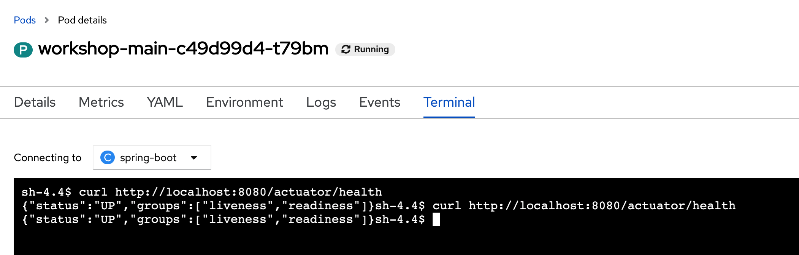
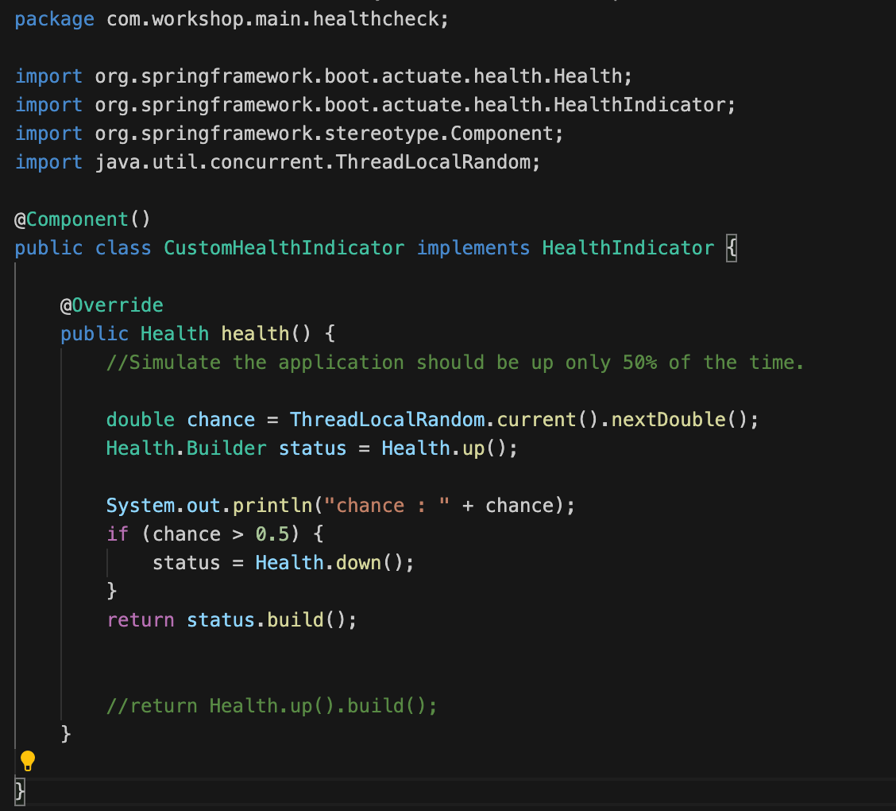

### Introduction

Red Hat CodeReady Workspaces uses Kubernetes and containers to provide any member of the development or IT team with a consistent, security-focused, and zero-configuration development environment. The user experience is as fast and familiar as an integrated development environment (IDE) on a laptop. CodeReady Workspaces encodes development projects as code that is checked into the Git repository and exposed via a Uniform Resource Locator (URL) or command-line interface (CLI) command. It creates all the containers needed to run the project, clones the sources where needed, and adds development tools (such as debuggers, language servers, unit test tools, and build tools) as sidecar containers so that the running application container continually mirrors production. Users can employ the included browser-based IDE if they do not have an IDE already set up, or they can opt for a local IDE.

In this workshop,  we have deployed CodeReady Workspace in Openshift Cluster for attendees to experience how easy to develop services and deploy it into openshift cluster. 

This lab is break into the following sections: 

* Deploy Existing Spring Boot Project in Github.
  
This is to let attendee to experience how to import existing spring boot project into CodeReady Workshop and deploy it into Openshift and use Openshift Developer Console to deploy a Node JS application.  

* Deploy Node JS application using Developer console

This is to let attendee to experience application deployment using Developer console. 

* Rolling Deployment 

This is to let attendee to experience how does the rolling deployment works in Openshift. 

* Health Check 

This is to let atttendee to experience how does the application's health check works in Openshift. 

### Deploy existing spring boot project in GitHub.  

* Open a new browser tab with the url as [CodeReady Workspace](https://codeready-openshift-workspaces.apps.cluster-19dc.19dc.sandbox811.opentlc.com).  Login as `%username%` and password as `openshift`.

* Click on [Allow selected permissions].

* Key in your email address, first name and last name.  Click on [Submit].


* Enter `https://github.com/likhia/INTERNAL_SERVICE_INIT.git` for `Git Repo URL`. Click on [Create & Open].   This will take a few mins to open the workspace. 


* If you see any pop up messages,  just close them. 

* Navigate to src/main/java/com/workshop/main/service/ServiceEndPoint.java.   This is the class that you will edit in the next few labs.  For a start,  this service will take in the vehicle details for registration and returned "UNASSIGNED" as the car plate number.   


* CodeReady Workspace provides scripts by default to build / run / deploy spring boot application to openshift.   Click on the box icon on the right.  Click on `Build` to build the application.  This might take a few minutes.


* `Build Successful` will be showed in the Terminal if successful.   If you encounter error,  please check with the instructor or lab assistant.


* Click on 'Run' to run the application.  Click on [Open in New Tab].  


* Copy the URI and replace `$REPLACE WITH YOUR URL` with the url in the browser.
```
curl -X POST -H "Content-Type: application/json"  -d '{"model": "Toyota Vios", "color" : "RED", "type" : "NORMAL", "engineCapacity" : "1.6", "createdYear" : "2021" , "used" : false, "user" : "user1"}'  $REPLACE WITH YOUR URL/api/service/registervehicle 
```
* Click on `New terminal` on the right panel.  Copy and paste the above and you will see "UNASSIGNED" returned.
 

* The application is working fine.  Next step is to deploy the application into openshift.   Use the same Terminal.  Type **oc login `https://api.cluster-19dc.19dc.sandbox811.opentlc.com:6443` -u `%username%` -p `openshift`** and `Y` when prompt. 

* Type `oc new-project service-%username%` to create new project to deploy application. 


* Click on `Deploy to Openshift`. This will make use of Source-to-image (S2I) to produce ready-to-run images by injecting source code into a container that prepares that source code to be run.  


* After it is successful, click on **console**. Switch to `Developer` mode.  Go to `Topology`.   You will see the application deployed successfully into `service-%username%` project. Please wait till the circle turned dark blue as shown below.                    


* Click on icon on the right-hand upper corner.   You will see the same application as shown earlier. 

* Navigate back to `Code Ready`.  Go to the Terminal and type the below.   You will get the same result.  

```
curl -X POST -H "Content-Type: application/json"  -d '{"model": "Toyota Vios", "color" : "RED", "type" : "NORMAL", "engineCapacity" : "1.6", "createdYear" : "2021" , "used" : false, "user" : "user1"}'  http://$(oc get route workshop-main  -o jsonpath='{.spec.host}')/api/service/registervehicle
```

### Deploy Node JS application using Developer console

* Next, we will use the developer console to import an existing Node JS application which provide the web UI for this application. 

* Stay at `Developer` mode.  Click +Add.  Click `From Git`. Set `Git Repo URL` as `https://github.com/likhia/nodejs-web-app-services.git`.  


* Click on `Edit Import Strategy` 
* **Scroll down** to `Builder Image version`.  Select `12-ubi8`.   Set the `Application name` and `Name` as `submitrequest`.  


* **Scroll down** to `Advanced Options`.  Click on `Build Configuration`. 


* Add the following environment variables.  Click on [Create].
  * **COLOR** : white -- This is to set the background color as white. 
  * **ENDPOINT** : http://submitrequest-service-%username%.apps.cluster-2e68.2e68.sandbox1783.opentlc.com/ -- This is pointing to URI of current UI. Please note that this URL must end with /. 
  * **HOSTNAME** : workshop-main.service-%username%.svc.cluster.local  -- This is pointing to the service that you just deployed.     


* Use [Service].[Namespace].svc.cluster.local to invoke services  within the same Openshift Cluster.

* Wait till the circle turned dark blue as shown below.  Click on icon highlighted in red below.   


* Use this UI to register a new Vehicle. 


* For now, `UNASSIGNED` is returned as the car plate number. Keep this page open in browser for next section. 


### Rolling Deployment 

* A deployment strategy is a way to change or upgrade an application.  Rolling deployments are the default type in OpenShift Container Platform. 

* In the code below,  this service takes in one environment variable named FAILURE. If its value is `true`,  it will throw exception which means the service will be unavailable. 


* When we change the environment variable of this deployment, it will trigger the rolling deployment.  

* Switch to `Administrator` mode. Navigate to `Workloads` -> `Deployments`.  Click on `workshop-main`. 

* Click on `Environment` tab. Click on `Add more`.

* Add a new environment variable with name as `FAILURE` and value as `true`.  Click on [Save]. 


* Click on `Workloads` -> `Pods`.   You will see a new pod is running and the original pod is terminating.  Please wait for the new pod to be running and original pod is removed. 


* Access the `submitrequest` page again.  If the page is closed,  navigate to `Networking` -> `Route` and click on `Location` of `submitrequest`.


* Submit a request again and you will see the request is failed.


* Navigate to `Workloads` -> `Deployments`.  Click on `workshop-main`.  Clicke on `Environment` tab.   Change the value of `FAILURE` to `false`. 

### Health Check

* A health check periodically performs diagnostics on a running container using any combination of the readiness, liveness, and startup health checks.
  * **Readiness** : Determines if a container is ready to accept service requests. If the readiness probe fails for a container, the kubelet removes the pod from the list of available service endpoints.
  * **Liveness** : Determines if a container is still running. If the liveness probe fails due to a condition such as a deadlock, the kubelet kills the container.
  * **StartUp** : Indicates whether the application within a container is started. All other probes are disabled until the startup succeeds.

* Navigate to `Workloads` -> `Deployments`.  Click on `workshop-main`.  Click on `YAML` tab.  Scroll down and you will see the readiness and liveness probes configure with `/actuator/health`. 


* `/actuator/health` endpoint report an aggregated result of all registered HealthIndicators.  It is used to inspect the health status of a Spring Boot application. 

* Click on `Pods` tab. Click on the only one Pod instance. 

* Click on `Terminal` tab.  Type `curl http://localhost:8080/actuator/health`.  You will see as below. 


* We can register custom HealthIndicators to report the health of a component or subsystem. This requires an implementation of the HealthIndicator interface as a Spring bean.

* Navigate to your `CodeReady Workspace`.  Open the same project that was imported earlier.    

* Navigate to src/main/java/com/workshop/main/healthcheck/CustomHealthIndicator.java.   Currently it always returned status as `Up`.  Uncomment the codes above and comment the last line.  Uncomment the import class too.   This class should look the same as below.  


* Click on the box icon on the right.  Click on `Build` to build the application.

* Next step is to deploy the changes into openshift.   Open a new terminal.  Type **oc login `https://api.cluster-19dc.19dc.sandbox811.opentlc.com:6443` -u `%username%` -p `openshift`** and `Y` when prompt.

* Type `oc project service-%username%` to switch to correct project to deploy application.  

* Click on `Deploy to Openshift`.

* Let's make some change to deployment of this application to test this health check.

* Navigate to `Workloads` -> `Deployments`.  Click on `workshop-main`.  Click on `YAML` tab.

* Change the `periodSeconds` to 2 and the `failureThreshold` to 1 for readiness and liveness probe.  Click on [Save]


* Click on `Details` tab.   Increase the replicas to 2 as shown below.

 
* Monitor the changes for the next few mins.   You will see the deployment keep scaling up and down.   It is due to the liveness probe.  Kubelet is shutting down and restart pods based on its returned status.  

* Or switch to `Pods` tab.   You will see the same thing too. 

## Reset the changes 

* Navigate to your `CodeReady Workspace`.  Open the same project that was imported earlier.

* Navigate to src/main/java/com/workshop/main/healthcheck/CustomHealthIndicator.java.   Update the codes shown below. 
 

* Click on the box icon on the right.  Click on `Build` to build the application.

* Use the same terminal and type **oc project** to make sure you are still at `service-%username%` project.  If need to login again,  type **oc login `https://api.cluster-19dc.19dc.sandbox811.opentlc.com:6443` -u `%username%` -p `openshift`** and `Y` when prompt.

* Type `oc project service-%username%` to switch to correct project to deploy application.

* Click on `Deploy to Openshift`.

* Navigate to `Workloads` -> `Deployments`.  Click on `workshop-main`.  Click on `Details` tab to make sure that the application is always up. 

### Summary
In this exercise, you have learned to 

* Import existing Spring Boot into CodeReady Workshop.
* Build and test spring boot application.
* Deploy spring boot application into Openshift.
* Use Developer Console to deploy application and use environment variable to pass in parameters for application. 
* Update environment variables and how does the rolling deployment works. 
* Implement and configure health check for Spring Boot Applications in Openshift


