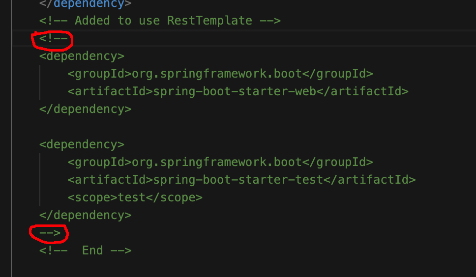
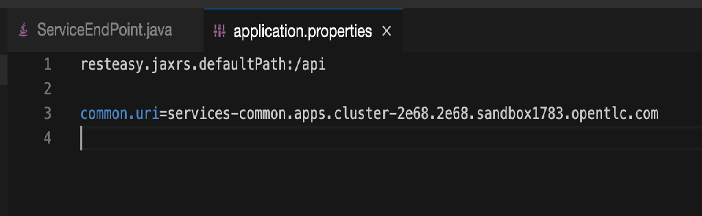
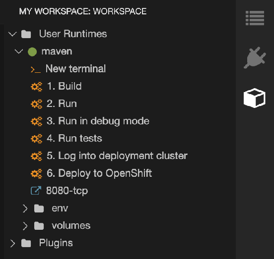
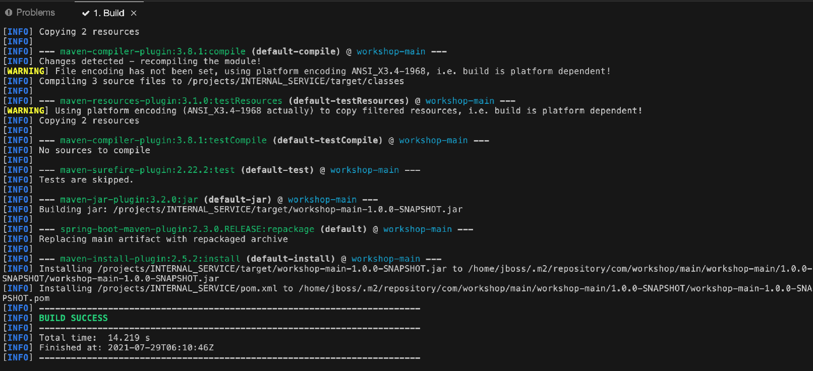
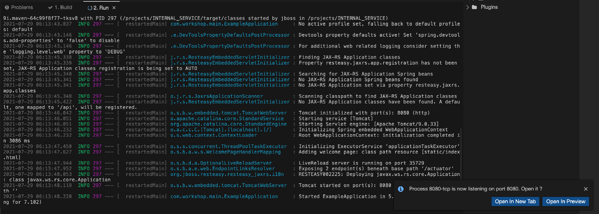
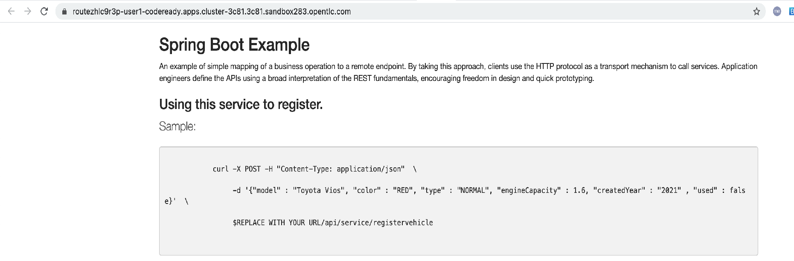
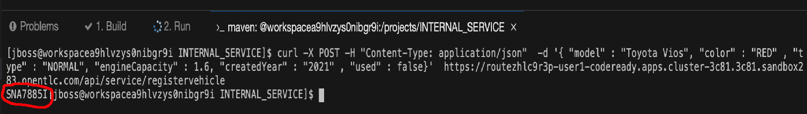
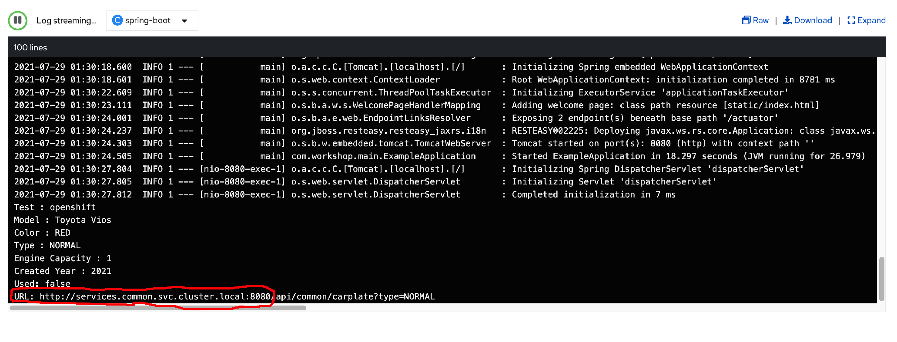

### Introduction

Application is typical made up through service orchestration.  In this lab, you will implement a service call with the imported project in the previous lab.   There is a common service to retrieve car plate number based on whether it is weekend car. This service is pre-created under the `common` project.     

Objective: 
* To learn how to call microservices in another project within same cluster.


### Implement service call 

* If project is not open,  please open the same project as the previous lab in Code Ready Workspace. 

* To call REST service in Spring Boot, the following libraries need to include in pom.xml.  Please refer to the diagram below. 


* Open `src/main/java/com/workshop/main/service/ServiceEndPoint.java`. Copy and paste the following under `//import classes (1)`.   
  * RestTemplate class is used to invoke the common service.  
  * Value class is used to populate the endpoint URI from the resources/application.properties.
```
//import classes (1)

import org.springframework.web.client.RestTemplate;
import org.springframework.beans.factory.annotation.Value;

```

* Copy and paste the following under `//Get URI from properties`.  This is to read value of common.uri from application.properties. 
```
//Get URI from properties

@Value("${common.uri}")
private String commonURI; 

```

* Copy and paste the following under `//Invoke common service`.   This is to invoke the common service to get car plate number based on car type (e.g WEEKEND or NORMAL).
```
/Invoke common service
/**
  * Invoke common service to get the car plate no. 
  * @param type
  * @return car plate No
 */
private String getCarPlate(String type) {

    String uri = "http://" + commonURI + "/api/common/carplate?type=" + type;

    System.out.println("URL: " + uri);

    RestTemplate restTemplate = new RestTemplate();
        
    return (String) restTemplate.getForObject(uri, String.class);
}
```

* Open `resources/application.properties`.  Copy and paste the following after `resteasy.jaxrs.defaultPath:/api`.  This URI is being used to access this common service from external. 
```
common.uri=services-common.apps.cluster-2e68.2e68.sandbox1783.opentlc.com
```


* Click on the cube icon on the right.  In this panel,  it will show a list of commands to build, run and deploy application into openshift. 


* Click on the `Build` and wait till it shows as `Build Success`.


* Click on the `2. Run` and wait till it shows as `Started ExampleApplication..`.


* Click on `Open in New Tab` button on the right bottom. 


* Copy the URI and replace `$REPLACE WITH YOUR URL` below.  
```
curl -X POST -H "Content-Type: application/json"  -d '{"model": "Toyota Vios", "color" : "RED", "type" : "NORMAL", "engineCapacity" : "1.6", "createdYear" : "2021" , "used" : false, "user" : "user1"}'  $REPLACE WITH YOUR URL/api/service/registervehicle 
```

* Click on `New terminal` on the right panel.  Copy and paste the above and you will see a car plate number returned. 


* Now this service is tested OK.  It is time to deploy into Openshift.  Before deployment, please open `/src/main/jkube` folder.  You see 3 yaml files under this folder.   Below are the explanation of usage of each yaml file. 
  * route.yml : This is generated by default when a new Spring Boot application is created in CodeReady Workshop.  You can use this to indicate the port number to use.  
  * configmap.yml: In the earlier step,  the common.uri property is read from resources/application.properties.   After this service is deployed into Openshift,  this property will be loaded from configmap.  Open configmap.yml and you will see the properties are set.  The value of common.uri is different.  It is set to `services.common.svc.cluster.local:8080` which is pointing the internal service within the same cluster instead of going through internet.  
  * deployment.yml: It is to configure this deployment to use the configmap. 

* Click on `New Terminal` in the right panel.  Type **oc login `https://api.cluster-19dc.19dc.sandbox811.opentlc.com:6443` -u `%username%` -p `openshift`** and `Y` when prompt.

* Type **oc project service-%username%**

* Click on `6. Deploy to Openshift`.   

* Please go back to Openshift Web Console.   Navigate to Workloads -> ConfigMaps.  You will see the `service-config-map` which contains the same properties as resources/application.properties. 
* Right-click on [Submit Request](http://submitrequest-service-%username%.apps.cluster-2e68.2e68.sandbox1783.opentlc.com) in a new tab to register a new vehicle.                                         

* Navigate to Workloads -> Pods.  Find the pod name with registervehicle*.  Click on it and click on Logs tab.  You will see the URL pointing the internal service instead of the route uri.


* Right-click on [Common Page](http://services-common.apps.cluster-2e68.2e68.sandbox1783.opentlc.com) in a new tab to search the new vehicle under `2. Get List of Vehicle By User`.  

### Summary

You have learnt 
* Implement REST call with Spring Boot. 
* How to make use of ConfigMap as properties file
* How to use ConfigMap in the Deployment

