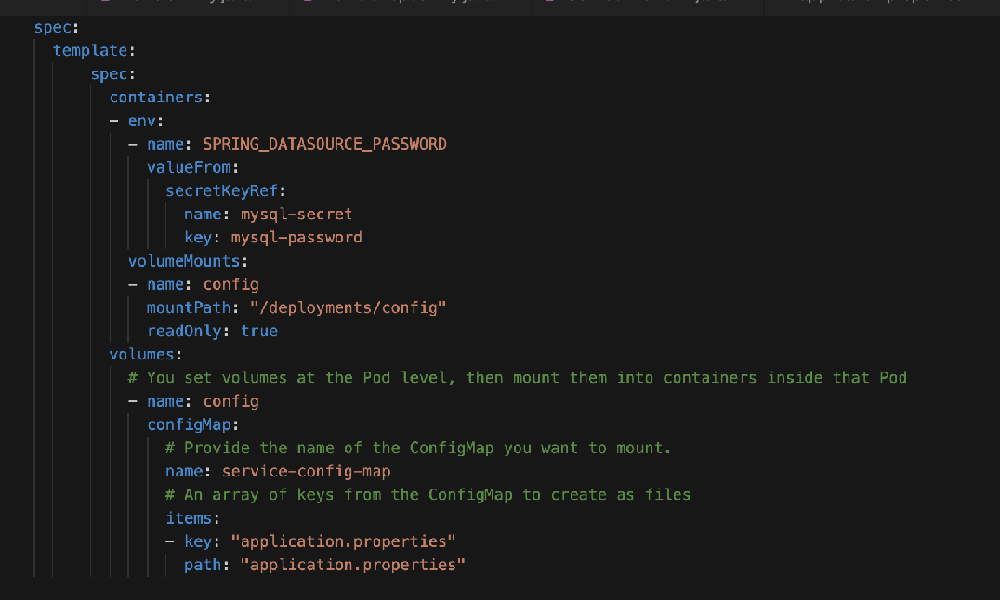

### Introduction

In this lab, you will save the vehicle information into MySQL database which is installed in `database` project.  There are 2 part of this lab. 
* Part A - Save vehicle information into database. 
* Part B - Encrypt the password of the database.     

Objective: 
* Learn how to integrate with MySQL database that is created in another project within same cluster.
* Learn how to use secret in openshift.
* Learn how to use environment variable. 

### Part A : Save vehicle information into database 

* If project is not open,  please open the same project as the previous lab in CodeReady Workspace. 

* To use Java Persistence API(JPA) in Spring Boot, the following libraries need to include in pom.xml.  Please refer to the diagram below and remove the comment as circle in red. 


* Navigate to `src/main/java/com/workshop/main`.  Right-click on `main` folder and select `New Folder`. Name it as `entity`.

* Right-click on `entity` folder and select `New File`. Name it as VehicleEntity.java.  Copy and paste the following codes into VehicleEntity.java.
```
package com.workshop.main.entity;

import javax.persistence.Entity;
import javax.persistence.Table;
import javax.persistence.Id;
import javax.persistence.GeneratedValue;
import javax.persistence.GenerationType;

@Entity
@Table(name = "VEHICLES")
public class VehicleEntity {

    @Id
    @GeneratedValue(strategy = GenerationType.IDENTITY)
    private Long id;

    private String carplate = null;
    private String model = null;
    private String color = null;
    private String engineCapacity = null;
    private String createdYear = null;
    private String used  = null;
    private String type  = null;
    private String user = null;
    
    public String getModel() {
        return model;
    }

    public void setModel(String model) {
        this.model = model;
    
    }

    public String getColor() {
        return color;
    }

    public void setColor(String color) {
        this.color = color;
    }

    public String getEngineCapacity() {
        return engineCapacity;
    }

    public void setEngineCapacity(String engineCapacity) {
        this.engineCapacity = engineCapacity;
    }

    public String getCreatedYear() {
        return createdYear;
    }

    public void setCreatedYear(String createdYear) {
        this.createdYear = createdYear;
    }

    public String getUsed() {
        return used;
    }

    public void setUsed(String used) {
        this.used = used;
    }

    public String getType() {
        return type;
    }

    public void setType(String type) {
        this.type = type;
    }

    public String getCarplate() {
        return carplate;
    }

    public void setCarplate(String carplate) {
        this.carplate = carplate;
    }

    public String getUser() {
        return user;
    }

    public void setUser(String user) {
        this.user = user;
    }
}
```

* Right-click on `entity` folder and select `New File`. Name it as `VehicleRepository.java`.  Copy and paste the following codes into VehicleRepository.java.
```
package com.workshop.main.entity;

import org.springframework.data.repository.CrudRepository;

// This will be AUTO IMPLEMENTED by Spring into a Bean called VehicleRepository.
// CRUD refers Create, Read, Update, Delete

public interface VehicleRepository extends CrudRepository<VehicleEntity, Integer> {

}
```
* Below shows the final folder and files structure based on the changes made in the previous steps.


* Open `src/main/java/com/workshop/main/service/ServiceEndPoint.java`. Copy and paste the following under //import classes (2).   
  * Autowired is used to get the bean called VehicleRepository. 
```
//import classes (2)

import org.springframework.beans.factory.annotation.Autowired;
import com.workshop.main.entity.*;
```

* Copy and paste the following under //Define Repository.  
```
//Define Repositor

@Autowired
private VehicleRepository repository;
```

* Copy and paste the following under //Save new vehicle.   This is to save vehicle information into database.
```
//Save new vehicle
/**
 * Save new vehicle into database.
 * 
 * @param carInfo
 * @param carplate
*/
private void save(CarRegistration carInfo, String carplate) {
    VehicleEntity vehicle = new VehicleEntity();

    vehicle.setCarplate(carplate);
    vehicle.setModel(carInfo.getModel());
    vehicle.setColor(carInfo.getColor());
    vehicle.setEngineCapacity(carInfo.getEngineCapacity());
    vehicle.setType(carInfo.getType());
    vehicle.setCreatedYear(carInfo.getCreatedYear());
    vehicle.setUser(carInfo.getUser());
    vehicle.setUsed(carInfo.getUsed().toString());

    repository.save(vehicle);
}
```

* Invoke the `save` method after the `//Invoke save method`  in `registerVehicle` method.  
```
//Invoke save method
save(carInfo, plateNo);
``` 

* Open `resources/application.properties`.  Copy and paste the following after `common.uri`.  These properties are used to connect to database.  
  * The 'spring.datasource.url' is pointing the MySQLdatabase in `database` project.  This URI is being used to access the database from external. 
```
spring.datasource.url=jdbc:mysql://a65a541ea48824946a99ef3d4d47770b-1928168107.ap-southeast-1.elb.amazonaws.com:3306/cars
spring.datasource.username=admin
spring.datasource.password=redhat
spring.jpa.hibernate.ddl-auto=update

## Hibernate Properties
# The SQL dialect makes Hibernate generate better SQL for the chosen database
spring.jpa.properties.hibernate.dialect = org.hibernate.dialect.MySQL5InnoDBDialect
spring.datasource.testOnBorrow=true
spring.datasource.validationQuery=SELECT 1
```

* Click on the cube icon on the right. 

* Click on the `1. Build` and wait till it shows as `Build Success`.

* Click on the `2. Run` and wait till it shows as `Started ExampleApplication`.

* Click on `Open in New Tab` button on the right bottom. 

* Copy the URI and replace `$REPLACE WITH YOUR URL` below.  
```
curl -X POST -H "Content-Type: application/json"  -d '{"model": "Toyota Vios", "color" : "RED", "type" : "NORMAL", "engineCapacity" : "1.6", "createdYear" : "2021" , "used" : false, "user" : "user1"}'  $REPLACE WITH YOUR URL/api/service/registervehicle 
```

* Click on `New terminal` on the right panel.  Copy and paste the above and you will see a car plate number returned. 

* Open [Common Page](http://services-common.apps.cluster-2e68.2e68.sandbox1783.opentlc.com) in a new tab to search the new vehicle under `2. Get List of Vehicle By User`.

* Open `/src/main/jkube/configmap.yml` and copy and paste the following properties. The `spring.database.url` is pointing to the same database through service since this service is going to be deployed into openshift.  
```
    spring.datasource.url=jdbc:mysql://mysql.database.svc.cluster.local:3306/cars
    spring.datasource.username=admin
    spring.datasource.password=redhat
    spring.jpa.hibernate.ddl-auto=update

    spring.jpa.properties.hibernate.dialect = org.hibernate.dialect.MySQL5InnoDBDialect
    spring.datasource.testOnBorrow=true
    spring.datasource.validationQuery=SELECT 1
```


* Click on `New Terminal` on the right panel. Type **oc login `https://api.cluster-19dc.19dc.sandbox811.opentlc.com:6443` -u `%username%` -p `openshift`** and `Y` when prompt.

* Type **oc project service-%username%**

* Click on `6. Deploy to Openshift`.   

* Open [Submit Page](http://submitrequest-service-%username%.apps.cluster-2e68.2e68.sandbox1783.opentlc.com) in a new tab to register a new vehicle.

* Open [Common Page](http://services-common.apps.cluster-2e68.2e68.sandbox1783.opentlc.com) in a new tab to search the new vehicle under `2. Get List of Vehicle By User`.

### Part B : Encrypt Database Password with Secret

* It is not recommended to specify password as clear text in configmap.  Secret will be used to hold the sensitive information like password.

* Navigate to `/src/main/jkube`.  Right click on `jkube` folder and select `New File`.  Name it as `secret.yml`.  Copy and paste the following into this file. 
```
metadata:
  name: mysql-secret
data:
  mysql-password: cmVkaGF0
type: Opaque
```

* Open `/src/main/jkube/configmap.yml` and remove `spring.datasource.password=redhat` from the properties. 

* Open `/src/main/jkube/deployment.yml` and add the following before volumeMounts. 
```
- env:
  - name: SPRING_DATASOURCE_PASSWORD
    valueFrom:
      secretKeyRef:
        name: mysql-secret
        key: mysql-password
```


* Click on `6. Deploy to Openshift`. Please wait for it to be complete. 

* Open [Submit Request](http://submitrequest-service-%username%.apps.cluster-2e68.2e68.sandbox1783.opentlc.com) in a new tab to register a new vehicle.  

* Open [Common Page](http://services-common.apps.cluster-2e68.2e68.sandbox1783.opentlc.com) in a new tab to search the new vehicle under `2. Get List of Vehicle By User`. 

### Summary

You have learnt 
* Implement JPA API in Spring Boot.
* Use Secret in Openshift to hold password.
* Use environment variable to pass as parameter.

