### Introduction

In this lab.  you will use jenkins to deploy the same applications to SIT which is another project within the same cluster.   You will create another project named as `service%username%-SIT` for this.  The common service and database are already created in the SIT environment.   You will experience how to make changes to your configuration and move the same container image to SIT. 

Similarly, this lab has 2 parts. 
* Part A - Create Jenkins application.
* Part B - Write the pipeline in Jenkins.     

Objective: 
* Learn how to install Jenkins.
* Learn how to build pipeline with Jenkins.
* Learn how to deploy application from DEV to SIT. 

### Part A : Create Jenkins application.

* Please note that Jenkins operator is already installed by administrator.

* Click on Terminal tab and execute the command below to create new project for SIT and label project with env=SIT.  This will be used in the last lab. 
```execute
oc new-project service-sit-%username%
```

```execute
oc label namespace service-sit-test  env=SIT 
```

* Click on Console tab and select project as jenkins-%username%. 

* Navigate to Operators -> Installed Operators.
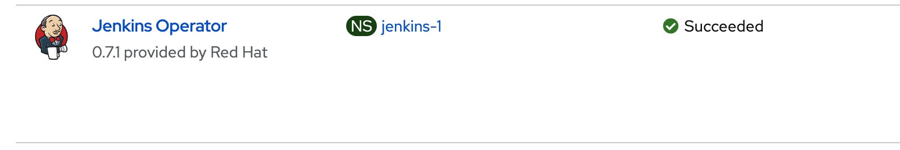

* Click on Jenkins Operator -> Jenkins tab. Click on Create Jenkins. Change `name` as `lab` and click on [Create].
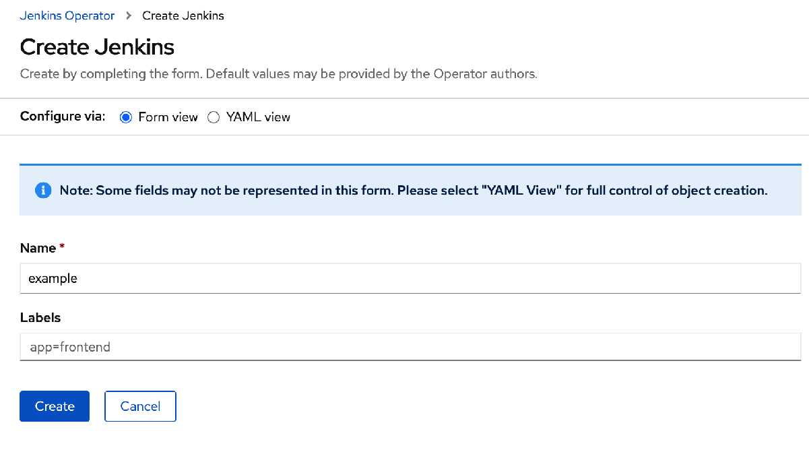

* This will take a few mins. Navigate to `Workloads` -> `Pods` to make sure that jenkins-lab is running.
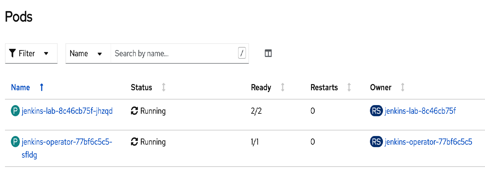

* Navigate to `Networking` -> `Routes`. Click on links under `Locations` to access Jenkins. Click on [Log In with Openshift]. Login using same user Id and password.
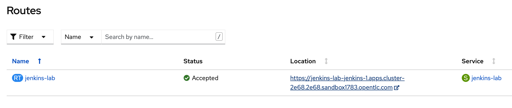

* Click on [Allows Selected Permissions]. This will take a while to go to the main page.
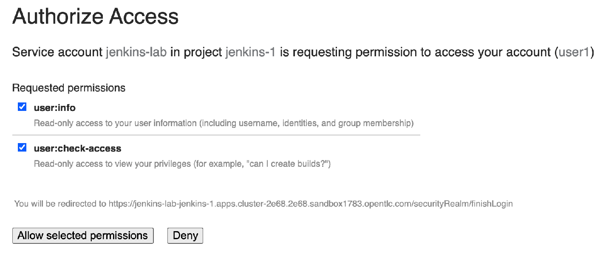

* Jenkins is installed.

* Click on Terminal tab and run the command below to grant the relevant access rights are given to deploy application in SIT. 
```execute
oc policy add-role-to-user admin system:serviceaccount:jenkins-%username%:default  -n service-%username%
```
```execute
oc policy add-role-to-user admin system:serviceaccount:jenkins-%username%:default  -n service-sit-%username%
```
```execute
oc policy add-role-to-user edit system:serviceaccount:jenkins-%username%:jenkins-lab -n service-%username%
```
```execute
oc policy add-role-to-user edit system:serviceaccount:jenkins-%username%:jenkins-lab -n service-sit-%username%
```
```execute
oc policy add-role-to-user system:image-puller system:serviceaccount:service-sit-%username%:default -n service-%username%
```

### Part B : Write the pipeline in Jenkins

* Next, you will create the pipeline to move the application from `service-%username%` to `service-sit-%username%`.

* Before creating the pipeline,  2 configuration files need to be created to be used in pipeline later.  
 
* Click on `Manage Jenkins`.
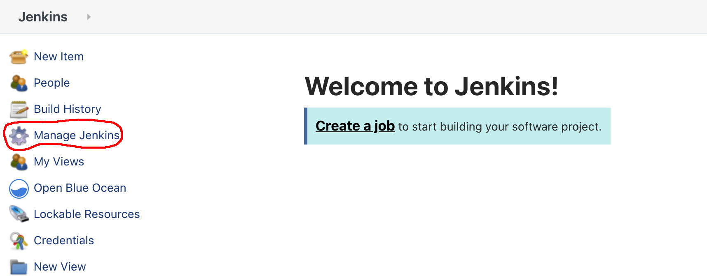

* Scroll to below.  Click on `Managed Files`. 
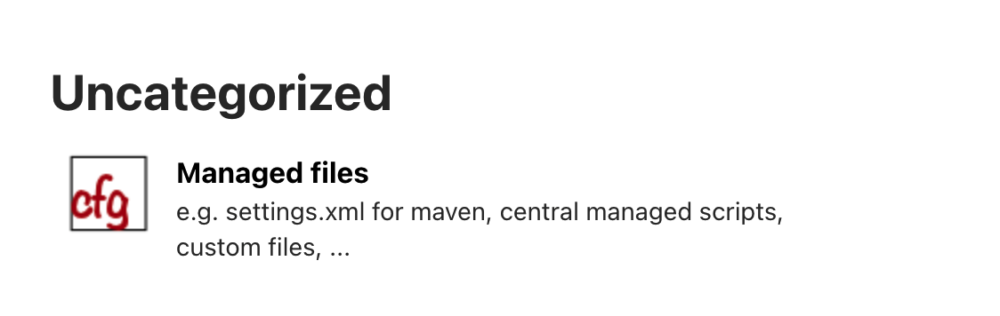

* Click on `Add a new Config`
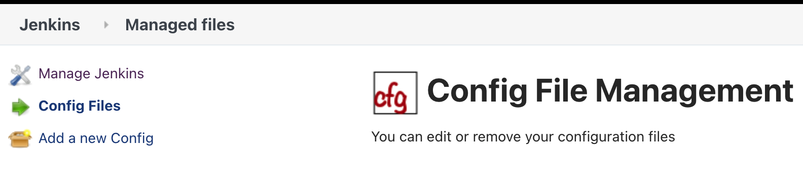

* Select custom file and set name as `SIT-application.properties`.  Click on [Submit].  This is used to create the configmap with the propoerties pointing to SIT. 
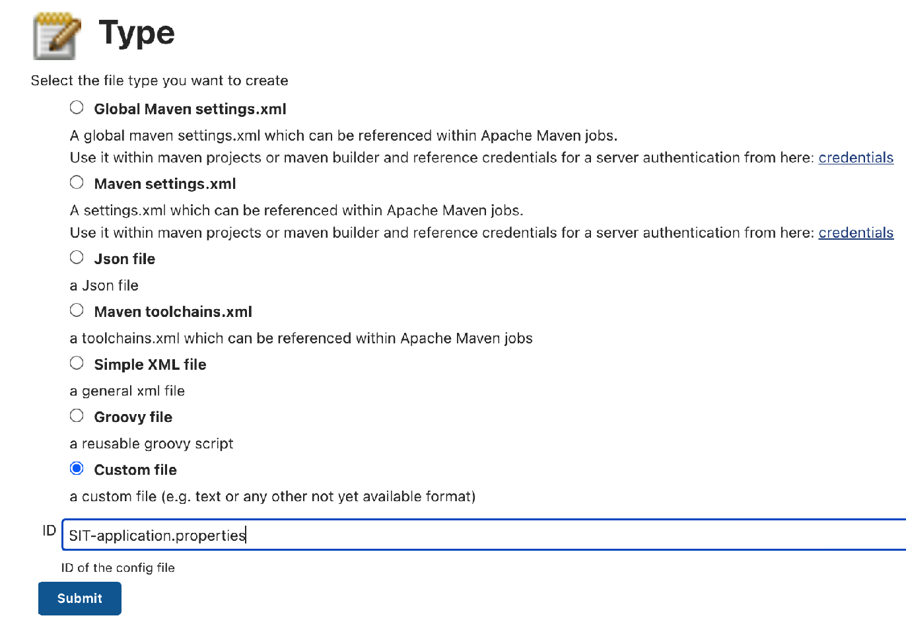

* Set `name` as `application.properties`.  Set `content` as below.
```
resteasy.jaxrs.defaultPath:/api
 
common.uri=services.common-sit.svc.cluster.local:8080
    
spring.datasource.url=jdbc:mysql://mysql.database-sit.svc.cluster.local:3306/cars

spring.datasource.username=admin

spring.jpa.hibernate.ddl-auto=update

spring.jpa.properties.hibernate.dialect = org.hibernate.dialect.MySQL5InnoDBDialect
spring.datasource.testOnBorrow=true
spring.datasource.validationQuery=SELECT 1
```
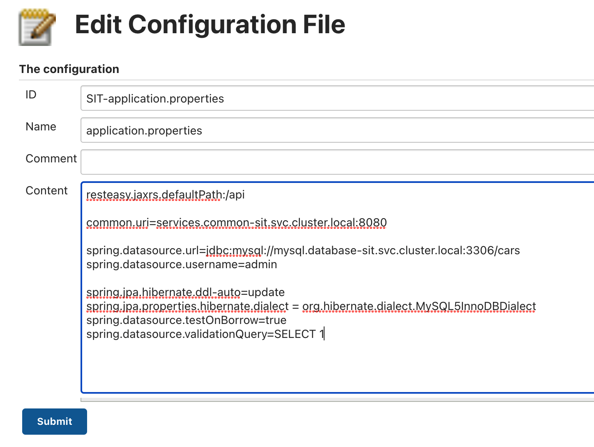

* Add another custom file with id as `Service-Deployment.yaml`, name as `Service-Deployment` and content as below. This is used to create the deployment with the same configurations in DEV.
```
kind: Deployment
apiVersion: apps/v1
metadata:
  name: workshop-main
  labels:
    app: workshop-main
    group: com.workshop.main
    provider: jkube
spec:
  replicas: 1
  selector:
    matchLabels:
      app: workshop-main
      group: com.workshop.main
      provider: jkube
  template:
    metadata:
      labels:
        app: workshop-main
        group: com.workshop.main
        provider: jkube
    spec:
      volumes:
      - name: config
        configMap:
          name: service-config-map
          items:
          - key: application.properties
            path: application.properties
          defaultMode: 420
      containers:
      - name: spring-boot
        image : image-registry.openshift-image-registry.svc:5000/service-sit-%username%/workshop-main:sit
        env:
        - name: SPRING_DATASOURCE_PASSWORD
          valueFrom:
            secretKeyRef:
              name: mysql-secret
              key: mysql-password
        - name: KUBERNETES_NAMESPACE
          valueFrom:
            fieldRef:
              apiVersion: v1
              fieldPath: metadata.namespace
        ports:
        - name: http
          containerPort: 8080
          protocol: TCP
        volumeMounts:
        - name: config
          readOnly: true
          mountPath: /deployments/config
```
* Clicks on `Jenkins` on the top left. This will return to main page.  Click on `New Job`. 

* Set name as `MovetoSIT`, select pipeline and click on [Submit]. 
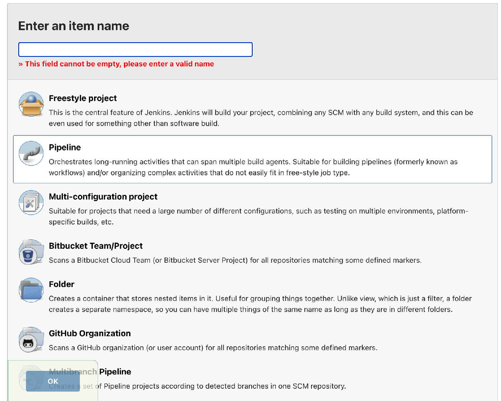

* Scroll to below.  Copy and paste below into the Script.  Click on [Submit]. 
```
def DEV_NS = "service-%username%"
def SIT_NS = "service-sit-%username%"
def DEV_IMAGE = "workshop-main:latest"
def SIT_IMAGE = "workshop-main:sit"
def DEV_UI_IMAGE = "submitrequest:latest"
def SIT_UI_IMAGE = "submitrequest:sit"

def APP_NAME= "workshop-main"
def UI_NAME= "submitrequest-white"

pipeline {
   agent any
   
   environment {
        APPLICATION_CONFIG = '${WORKSPACE}@tmp/application.properties'
        YAML_CONFIG = '${WORKSPACE}@tmp/deployment.yaml'
   }

   stages {
        stage("Enter password for MySQL") {
            steps {
                sh "oc project ${SIT_NS}"
                timeout(time: 30, unit: 'SECONDS') {
                    script {
                          env.PASSWORD = input message: 'Please enter the password',
                                             parameters: [password(defaultValue: '',
                                                          description: '',
                                                          name: 'Password')]

                        }
                        
                               
                        sh "oc create secret generic mysql-secret --from-literal=mysql-password=${env.PASSWORD}"
                }
            }
        }
        
        stage ('Create ConfigMap') {
          steps {
            configFileProvider([configFile(fileId: 'SIT-application.properties', variable: 'service_config')]) {
                sh "cp ${env.service_config} ${APPLICATION_CONFIG}"
               
                sh "oc create configmap service-config-map --from-file=${APPLICATION_CONFIG}"
                sh "sleep 5s"
                sh "rm ${APPLICATION_CONFIG}"
                
            }
          }
        }
        
        stage ('Move Main service to SIT') {
            steps {
                sh "oc -n $DEV_NS tag $DEV_NS/$DEV_IMAGE $SIT_NS/$SIT_IMAGE"
                sh "sleep 10s"
                sh "oc project $SIT_NS"
                //sh "oc new-app --name=$APP_NAME  --image-stream='$SIT_NS/$SIT_IMAGE'"
                //sh "oc expose svc $APP_NAME"
              
                configFileProvider([configFile(fileId: 'Service-Deployment.yaml', variable: 'service_deploy')]) {
                    sh "cp ${env.service_deploy} ${YAML_CONFIG}"
                   
                    sh "oc apply -f ${YAML_CONFIG}"
                    sh "sleep 5s"
                    sh "oc expose deployment/$APP_NAME"
                    sh "oc expose svc $APP_NAME"
                    sh "rm ${YAML_CONFIG}"
                    
                }
              
            }

        }

        stage ('Move UI to SIT') {
            steps {
              sh "oc -n $DEV_NS tag $DEV_NS/$DEV_UI_IMAGE $SIT_NS/$SIT_UI_IMAGE"
              sh "sleep 10s"
              sh "oc project $SIT_NS"
              sh "oc new-app --name=$UI_NAME  --image-stream='$SIT_NS/$SIT_UI_IMAGE' -e COLOR=white -e ENDPOINT=http://submitrequest-white-service-sit-%username%.apps.cluster-2e68.2e68.sandbox1783.opentlc.com/ -e HOSTNAME=workshop-main.service-sit-%username%.svc.cluster.local"
              sh "oc expose svc $UI_NAME"
              
              
            }

        }

   }

}

```
* The 1st stage (**Enter password for MySQL**) is to get the password of MySQL in SIT to create secret. 

* The 2nd stage (**Create ConfigMap**) is to create the configmap containing the properties specified in the `SIT-application.properties`.

* The 3rd stage (**Move Main service to SIT**) is to copy the container image of the service from service-%username% to service-sit-%username%.  Create the similar deployment using `Service-Deployment.yaml` which is copied from service-%username%.

* The last stage (**Move UI to SIT**) is to copy the container image of the UI from service-%username% to service-sit-%username%.

* Click on `Build Now` on the left panel.  There will be a new build #.  Click on it. 
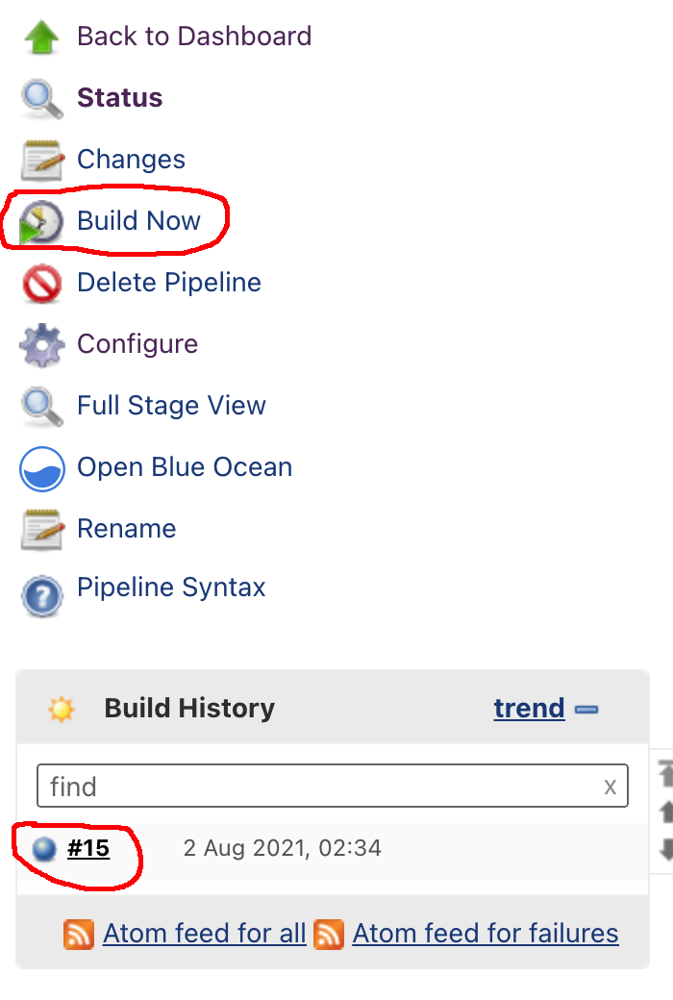

* Click on `Console Output` on the left panel.  Click on `Input Request`
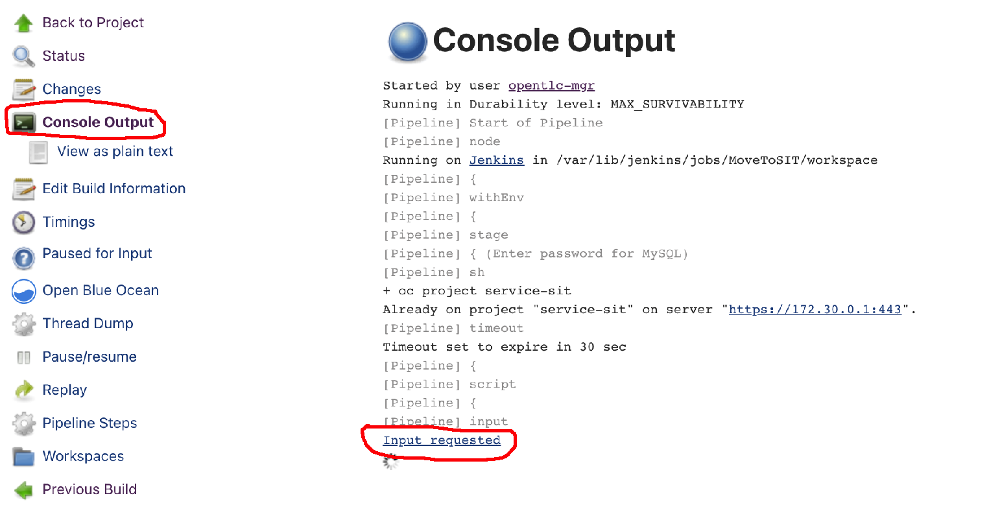

* Click on [Change Password].  Set password as `password`.  Click on [Proceed]  
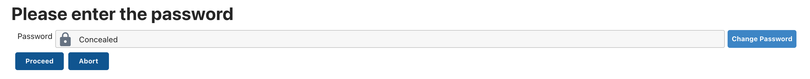

* The pipeline will continue to execute.  If you see `success` as below,  the pipeline is executed successful.  
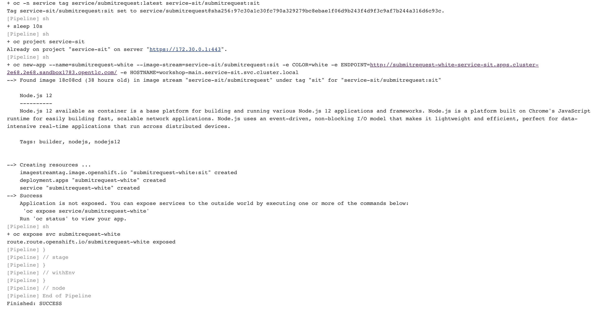  

* Go to console. Switch project to `service-sit-%username%. 

* Navigate to 'Networking' -> 'Routes'.  Click on `Location` of `submitrequest-white`.   Create a new vehicle registration. 

* Open [Common Page](http://services-common-sit.apps.cluster-2e68.2e68.sandbox1783.opentlc.com) and search the new vehicle under `2. Get List of Vehicle By User`. This list is retrieved from database in SIT. 


### Summary

You have learnt 
* Use Jenkins to implemeent pipeline. 
* To move deployment from one project(DEV) to another(SIT). 


