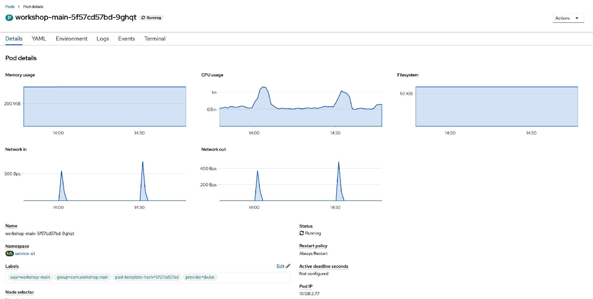
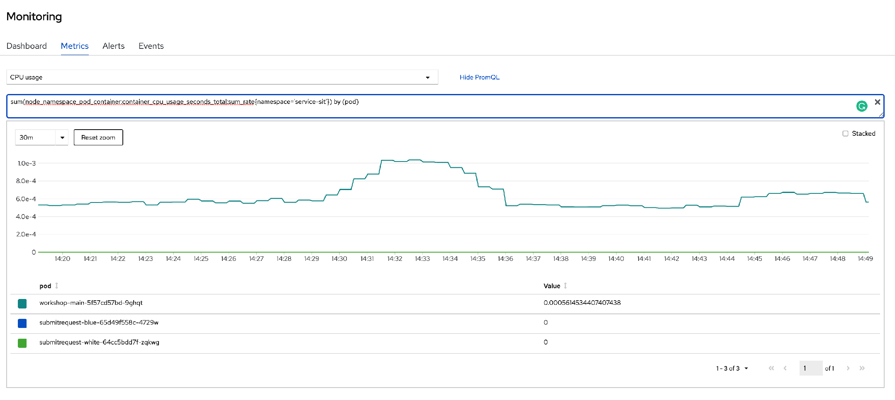

### Introduction

Developer need to monitor the application deployed and access the logs for investigating issues.   You will learn how to monitor and access log for your deployed application. 

### Monitor your application an accessing logs 

* Please open another brower tab for [Openshift Console](https://console-openshift-console.apps.cluster-19dc.19dc.sandbox811.opentlc.com).  Login as `%username%` and password as `openshift`.

* Switch to `Developer` mode.  Select `service-sit-%username%` project.  You see the applications that you have deployed in exercise 5.  

* Click on `workshop-main`.  Click on the `Details` tab. You will see the details of this deployment.  

* Click on the `Resources` tab.  You will see the pod / the build / service and route for this deployment.    

* Click on `View logs` of the pod. This is where you can view the logs of the application.

* Click on 'Details' tab to view the Memory usage, CPU usage, Filesystem, Network In, Network out and other details about the pod running the application. 

* Click on **Observe** on the left. Click on `Dashboard` tab.  You will see graphs depicting the CPU, memory, and bandwidth consumption and network related information.

* Click on `Metric` tab.  Select `CPU usage` from dropdown list.  Click on `Show PromQL`. You will see the CPU utilization for this application and also the Prometheus query for this chart.  

* Please refer to https://docs.openshift.com/container-platform/4.7/applications/odc-monitoring-project-and-application-metrics-using-developer-perspective.html#odc-monitoring-your-project-metrics_monitoring-project-and-application-metrics-using-developer-perspective for more details. 

### Summary
In this lab,  you have learned how to monitor application and also access the logs of your application. 
