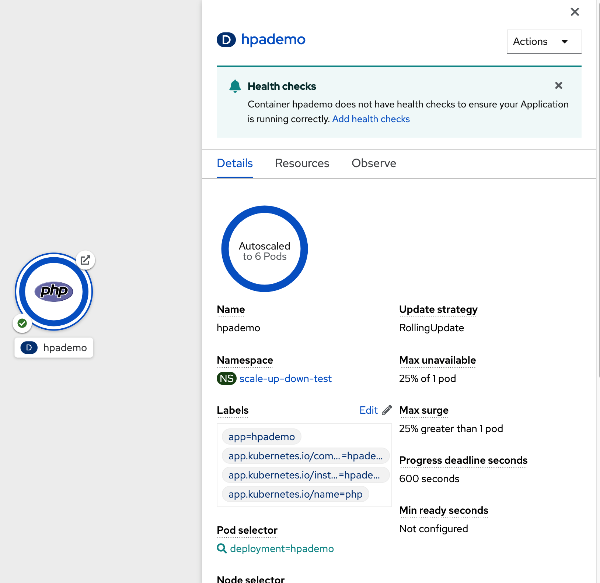

i### Introduction

In this exercise we will learn how to scale our application. OpenShift has the capability to scale your application based on the workload.

First we will deploy an application, scale it up and down manually. We will also learn **Idling** which is a unique concept in OpenShift. 

Then we will learn to setup horizontal pod autocaler that automatically scales your application based on the workload and scales down when the workload reduces.

### Deploy an Application to Scale

* Switch to Terminal 

* Create a new Project
```execute
oc new-project scale-up-down-%username%
```

* Deploy an application
We will deploy a simple PHP application that has `index.php` which does some computation. You can deploy using web console or CLI. Steps below show the deployment using CLI by running `oc new-app --image-stream=php --code=https://github.com/RedHatWorkshops/hpademo` as shown below
```execute
oc new-app --image-stream=php --code=https://github.com/RedHatWorkshops/hpademo
```


* This will start an S2I build for the php application. You can run `oc get builds` and also watch the logs by running `oc logs -f hpademo-1-build`.

* Create a route by exposing the service
```execute
oc expose svc hpademo
```
```
route.route.openshift.io/hpademo exposed
```

* Run `oc get route` to get the URL for your application. Eventually your application gets built and deployed. If you curl the URL you will see that the `index.php` page does some computation and displays `OK!`
```execute
curl $(oc get route hpademo --template={{.spec.host}})                                                                                      
```
```
OK!
```

### Scaling

Understanding Replicas Setting in Deployment Configuration vs Replication Controller.  

Check the deployment configuration for this application by running `oc get dc/hpademo` and focus on `spec`

```execute
oc get deployment/hpademo -o yaml

```

```
spec:                                                                                                                                                              
  replicas: 1  
```

You'll notice that the `replicas:` is set to `1`. This tells OpenShift that when this application deploys, make sure that there is 1 instance running. The `replicationController` mirrors this configuration initially; the `replicationController` (or `rc`) will ensure that there is always the
set number of instances always running.

* Get the current pods.  Please note that the pod name will not be the same as shown below. 

```execute
oc get pods
```


### Manual Scaling

* To scale your application we will edit the `deployment` to 3.

* Open `console` tab.  Switch to `Developer` and select project as `scale-up-down-%username%`. Go to the `Topology` page and note you only have one instance running and click on the circle to view the overview of this deployment.  You will see the pod is 1. 


* Now scale your application using the `oc scale` command.  Click on Terminal tab.
```execute
oc scale --replicas=3 deployment/hpademo                                                                                                            
```

* If you look at the `console` and you will see that there are 3 instances running now


**Note:** You can also scale up and down from the web console by navigating to overview page and clicking twice on up arrow right next to the pod count circle to change replica count.


### Idling

* A related concept is application idling. OpenShift allows you to conserve resources by sleeping the application when not in use. When you try to use the application it will spin up the container automatically.

* Run the following command to find the available endpoints

```execute
oc get endpoints                                                                                                                            
```

```
NAME      ENDPOINTS                                                        AGE                                                                                     
hpademo   10.128.2.37:8443,10.129.2.29:8443,10.130.2.28:8443 + 3 more...   37m 
```

* Note that the name of the endpoints is `hpademo` and there are three ip addresses for the three pods.

* Run the `oc idle endpoints/hpademo` command to idle the application

```execute
oc idle endpoints/hpademo                                                                                                                   
```
```
The service "scaling-user1/hpademo" has been marked as idled                                                                                                       
The service will unidle DeploymentConfig "scaling-user1/hpademo" to 3 replicas once it receives traffic                                                            
DeploymentConfig "scaling-user1/hpademo" has been idled  
```

* Go back to the web console. You will notice that the pods show up as idled.


At this point the application is idled, the pods are not running and no resources are being used by the application. This doesn’t mean that the application is deleted. The current state is just saved.. that’s all.

### Reactivate your application

* Now click on the application route URL or access the application via curl. Note that it takes a little while for the application to respond. This is because pods are spinning up again. You can notice that in the web console. In a little while the output comes up and your application would be up with 3 pods (based on your replica count).  So, as soon as the user accesses the application, it comes up!!!

```execute
curl $(oc get route hpademo --template={{.spec.host}})     
```

### Scaling Down

* Scaling down is the same procedure as scaling up. Use the `oc scale` command on the `hpademo` application `dc` setting.

```execute
oc scale --replicas=1 deployment/hpademo
```

* Alternately, you can go to project overview page and click on down arrow twice to remove 2 running pods.

### Auto Scaling

Horizontal Pod AutoScaler (HPA) allows you to automatically scale your application based on the workload. It updates `replicacount` by watching the workload. 

#### Set Resource Limits on your application

* HPA requires your pods to have requests and limits set so that it knows when to scale the application based on the consumption of resources.

* Let us update the deployment to set the resources by running `oc set resources`

```execute
oc set resources deployment hpademo --requests=cpu=200m --limits=cpu=500m                                                                           
```

* We have set the CPU request (initial allocation) as `200` millicores and limit (maximum allocation) to `500` millicores. So when we ask HPA to scale based on percentage workload, it measures based on these numbers.

#### Set up HPA

* Now we will create HPA by running `oc autoscale` command

```execute
oc autoscale deployment hpademo --cpu-percent=50 --min=1 --max=10                                                                                   
```


Here we are did two things:

* `cpu-percent=50` indicates that when the CPU usage (based on requests and limits) reaches 50%, HPA should spin up additional pods
* `--min=1 --max=10` sets upper and lower limits for the number of pods. We want to run minimum 1 pod and maximum it can scale up to 10 pods. Why? We cannot allow our application to consume all resources on the cluster.. right?

### Generate Load

Now it is time to generate load and test

* Click on the **below terminal** and copy & paste below to run the load generator pod from that terminal.

```
oc run -it --rm load-generator --image=busybox /bin/sh
```
```
If you don't see a command prompt, try pressing enter.
~ $ 

```

This spins up a `busybox` image from where we will generate the load. 

* In the **top terminal**, get the URL for your application `oc get route hpademo --template={{.spec.host}}`, and use that in the following command inside the load generator at the prompt

```execute
oc get route hpademo --template={{.spec.host}}
``` 

* Take this URL to replace with URL below. 
```
while true; do wget -q -O- `URL`; done
```

* You will start seeking a bunch of `OK!` s as the load generator continuously hits the application. 

### Watch Scaling

* Open `console` tab.  Switch to `Developer` and select project as `scale-up-down-%username%`. Go to the `Topology` page.   Click on `hpademo` and monitor the no of pods. 


**NOTE** Scale up takes a few mins and so does Scale down. So be patient.

### Clean up

* Delete all the artifacts.
```execute
oc delete all --all
```

* Delete the project. 
```execute
oc delete project scale-up-down-%username%
```
### Summary

In this lab we have learnt to manually scale up and scale down, and idle the application. We have also learnt to use horizontal pod autoscaler to autoscale the application based on the workload.


