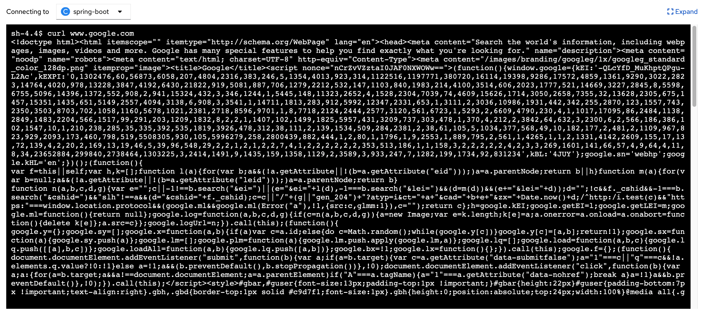
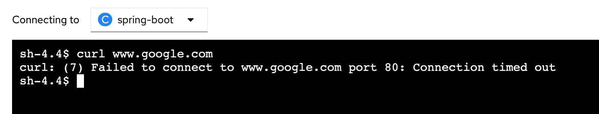

### Introduction

By default, all pods in a project are accessible from other pods and network endpoints. To isolate one or more pods in a project, you can create NetworkPolicy objects in that project to indicate the allowed incoming connections. Project administrators can create and delete NetworkPolicy objects within their own project.

If a pod is matched by selectors in one or more NetworkPolicy objects, then the pod will accept only connections that are allowed by at least one of those NetworkPolicy objects. A pod that is not selected by any NetworkPolicy objects is fully accessible.

### Create Network Policy to restrict Ingress access

* In the exercise 5,  we have labelled your project, `service-sit-%username%` with `env=sit` so that your project is able to access database in `database-sit` project with the network policies below.  The 2 default network policies are deleted.  The defaulted policies allow all pods in this project are accessible from other pods and network endpoints.  

* Network Policy to deny all traffics. 
```
kind: NetworkPolicy
apiVersion: networking.k8s.io/v1
metadata:
  name: deny-by-default
  namespace: database-sit
spec:
  podSelector: {}
  policyTypes:
    - Ingress

```

* Network Policy to allow Ingress traffic from projects with label (env: sit). 
```
kind: NetworkPolicy
apiVersion: networking.k8s.io/v1
metadata:
  name: allow-sit-services
spec:
  podSelector:
    matchLabels:
      name: mysql
  ingress:
    - from:
      - namespaceSelector:
          matchLabels:
            env: sit
```

* Navigate to `Terminal` tab.  Now let's remove this label. 

```execute
oc label namespace service-sit-%username%  env-
```  
```execute
oc get pods -n service-sit-%username% 
```

* Delete pods with name starts with workshop-main*. Change the name according to your environment. 
```execute
oc delete pod workshop-main-5dcf55d7dc-7fxmv -n service-sit-test 
```
```execute
oc get pods -n service-sit-%username%
```

* View the logs for the new pod.  Change the name of pod according to your environment.   You will see error message to connect to database. 
```execute
oc logs -f workshop-main-5dcf55d7dc-4l4fk -n service-sit-test
```

* Set the label again.  Delete the `workshop-main*` pod again and monitor the logs of the new pod.  It is able to connect to the database again. 
```execute
oc label namespace service-sit-%username%  env=sit
```

### Restrict egress traffic

* Egress firewall is used to limit the external hosts that some or all pods can access from within the cluster.

* By default, Red Hat Universal Base Image (UBI) has not installed the ping(iputils) command. So we will use curl instead.  

* Navigate to `Console` tab.  Navigate to service-sit-%username% project.  Go to `Workloads` -> `Pods`.  Click on the pod with name starts with `workshop-main`.  

* Click on `Terminal` tab.  Type curl www.google.com. 


* Navigate to `Terminal` tab of the workshop.  
```execute
echo "
apiVersion: network.openshift.io/v1
kind: EgressNetworkPolicy
metadata:
  name: denyegress
  namespace: service-sit-%username%
spec:
  egress: 
  - type: Deny
    to:
      cidrSelector: 0.0.0.0/0
" >> denyegress.yaml
```
```execute
oc create -f denyegress.yaml
```

* Open the same pod again.  Click on `Terminal` tab.  Type curl www.google.com. You will see connection timeout from sometimes. 


### Summary

In this exercise, you have learned to

* use Network policy to isolate access between projects. 
* use Network policy to block egress traffics. 


